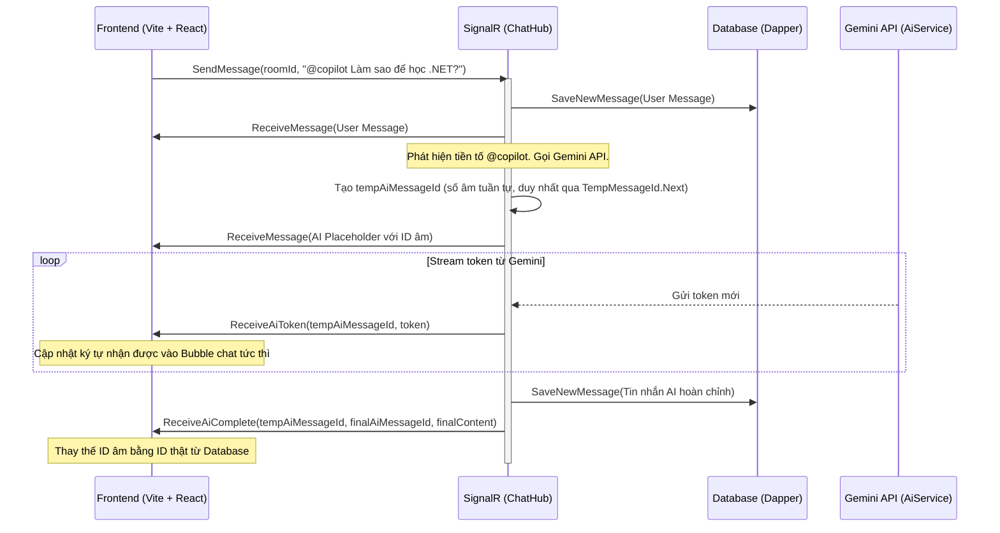

# 🌐 Real-time AI Chat Copilot - Project Context

Tài liệu này cung cấp cái nhìn toàn diện về cấu trúc thư mục, kiến trúc kỹ thuật, luồng dữ liệu và trạng thái hiện tại của dự án **AI Chat Realtime MVP**. Tài liệu giúp các phiên làm việc tiếp theo hiểu ngay hệ thống mà không cần đọc lại toàn bộ mã nguồn.

---

## 🛠️ Công Nghệ Sử Dụng (Tech Stack)

Hệ thống được xây dựng trên mô hình Client-Server tách biệt:
- **Backend**: .NET 8 Web API, SignalR Hub quản lý kết nối thời gian thực.
- **Database**: PostgreSQL kết hợp **Dapper** (truy vấn SQL thuần, tuyệt đối không dùng EF Core).
- **Frontend**: React 19, TypeScript, Ant Design (antd) làm UI system.
  - **Giao diện**: Thiết kế kiểu PipelinePro với nền sáng mặc định + chế độ tối (light/dark), màu chính teal `#0D9488`.
  - **Font chữ**: Inter cho nội dung, Outfit cho tiêu đề (tải từ Google Fonts).
  - **Styling**: Bo góc mềm, CSS variables (token) ở `src/index.css` với `:root[data-theme="light"|"dark"]` cho theme consistency.
  - **Theme Control**: `ThemeContext` + nút `ThemeToggle`, lưu tùy chọn vào `localStorage` (key `nexivra-theme`).
  - **antd Integration**: `ConfigProvider` đồng bộ màu component (colorPrimary teal + light/dark algorithm).
  - **Ghi chú**: Tuân thủ không dùng màu tím (Purple Ban) — màu chính là teal, không phải indigo.
- **AI Integration**: Gemini API (`gemini-2.5-flash`) truyền dữ liệu dạng streaming qua SignalR. `AiService`/`TranslationService` dùng `HttpClient` được quản lý bởi `IHttpClientFactory`.
- **Hiệu năng (Backend)**: Toàn bộ truy cập DB qua Dapper là **async all-the-way** (không block thread pool); có index trên bảng `messages`; HttpClient được pool qua `IHttpClientFactory`. Xem mục "Lịch Sử Tối Ưu Hiệu Năng" bên dưới.

---

## 📁 Cấu Trúc Thư Mục & Các File Quan Trọng

```plaintext
NexivraChat/
├── backend/
│   └── NexivraChatBackend/
│       ├── Controllers/
│       │   ├── AuthController.cs          # Đăng ký & Đăng nhập (async), băm mật khẩu PasswordHasher, cấp JWT.
│       │   ├── RoomsController.cs         # Lấy danh sách phòng, lịch sử tin nhắn của phòng (phân trang) — async.
│       │   ├── UsersController.cs         # Danh sách user, tạo/lấy hội thoại 1-1, lịch sử tin nhắn riêng tư — async.
│       │   ├── ProfileController.cs       # API xem/cập nhật Profile & phân tích tính cách AI — async.
│       │   └── TranslationController.cs   # Endpoint POST /api/translation dịch tin nhắn qua TranslationService.
│       ├── Data/
│       │   ├── DapperContext.cs           # Khởi tạo kết nối NpgsqlConnection, cấu hình Map tên thuộc tính dạng snake_case.
│       │   └── DbInitializer.cs           # Tự tạo bảng (users, chat_rooms, private_chats, messages, user_profiles), tạo INDEX cho messages, seed phòng mặc định. (Đồng bộ — chạy 1 lần lúc khởi động.)
│       ├── Hubs/
│       │   └── ChatHub.cs                 # Trọng tâm điều phối SignalR: gửi tin nhắn (nhóm & 1-1), điều phối stream AI, presence & typing. Mọi truy cập DB đã async.
│       ├── Models/
│       │   ├── User.cs                    # Bản ghi User (id, username, password_hash, created_at).
│       │   ├── ChatRoom.cs                # Bản ghi ChatRoom (id, name, description).
│       │   ├── Message.cs                 # Bản ghi Message (id, room_id, private_chat_id, sender_name, content, created_at, is_ai).
│       │   ├── PrivateChat.cs             # Bản ghi PrivateChat (id, user1_id, user2_id, created_at).
│       │   └── UserProfile.cs             # Bản ghi UserProfile (user_id, bio, native_language, ai_analysis_json, last_analyzed_at).
│       ├── Repositories/                  # Tất cả repository dùng Dapper ASYNC (QueryAsync/ExecuteScalarAsync/...), cột tường minh (không SELECT *).
│       │   ├── UserRepository.cs          # Truy vấn dữ liệu User.
│       │   ├── RoomRepository.cs          # Truy vấn dữ liệu Room.
│       │   ├── MessageRepository.cs       # Lưu tin nhắn mới & lấy lịch sử (theo phòng / chat 1-1 / người gửi).
│       │   ├── PrivateChatRepository.cs   # Lấy hoặc tạo hội thoại 1-1 (đảm bảo u1<u2 cho UNIQUE).
│       │   └── ProfileRepository.cs       # CRUD Profile & dữ liệu AI phân tích (upsert ::jsonb).
│       ├── Services/
│       │   ├── TokenService.cs            # Tạo mã JWT Token thời hạn 7 ngày.
│       │   ├── AiService.cs               # Gọi Gemini REST (stream IAsyncEnumerable<string>) — HttpClient inject qua IHttpClientFactory.
│       │   ├── TranslationService.cs      # Gọi Gemini dịch thuật — HttpClient inject qua IHttpClientFactory.
│       │   ├── PresenceTracker.cs         # Theo dõi presence in-memory, đếm theo connectionId để xử lý nhiều tab.
│       │   └── TempMessageId.cs           # Sinh temp-ID âm DUY NHẤT cho tin nhắn AI đang stream (Interlocked.Decrement).
│       ├── Properties/
│       │   └── launchSettings.json        # Cấu hình cổng chạy backend (HTTP: 5182, HTTPS: 7103).
│       ├── Program.cs                     # Cấu hình ứng dụng: CORS, JWT Auth, SignalR, DI Container, AddHttpClient<AiService/TranslationService>.
│       └── appsettings.json               # Chuỗi kết nối DB PostgreSQL và khóa bí mật JWT.
│   └── NexivraChatBackend.Tests/
│       ├── PresenceTrackerTests.cs        # Unit test xUnit cho PresenceTracker (6 test cases).
│       └── TempMessageIdTests.cs          # Unit test xUnit cho TempMessageId (2 test: âm & duy nhất khi gọi đồng thời). Tổng cộng 8 test.
│
├── frontend/
│   └── nexivra-chat-frontend/
│       ├── src/
│       │   ├── components/
│       │   │   ├── CopilotPanel.tsx       # Bảng công cụ AI với giao diện PipelinePro (Tóm tắt phòng chat, Gợi ý chủ đề, Giải nghĩa thuật ngữ), nội dung Việt thân thiện.
│       │   │   ├── RoomSidebar.tsx        # Danh sách phòng chat + danh sách user (chat 1-1), tạo phòng mới, thông tin user và nút đăng xuất, hỗ trợ light/dark, nội dung Việt.
│       │   │   ├── ThemeToggle.tsx        # Nút bóng đèn ở header để chuyển đổi giữa light/dark theme.
│       │   │   └── Logo.tsx               # Logo thương hiệu Nexivra.
│       │   ├── theme/
│       │   │   └── ThemeContext.tsx       # Context provider cho theme management, hook `useTheme`, hàm `getInitialTheme`, lưu preference vào localStorage.
│       │   ├── views/
│       │   │   ├── LoginView.tsx          # Màn hình đăng nhập/đăng ký thiết kế PipelinePro (teal primary, Inter/Outfit font), nội dung Việt.
│       │   │   ├── ChatView.tsx           # Giao diện chính kết nối SignalR Client, hiển thị tin nhắn (nhóm & 1-1), stream AI, dịch tin, online count, typing indicator, hỗ trợ light/dark.
│       │   │   └── ProfileView.tsx        # Màn hình xem profile cá nhân và phân tích tính cách AI (radar/thẻ chỉ số).
│       │   ├── services/
│       │   │   └── api.ts                 # Cấu hình Axios, tự động đính kèm JWT Token vào Header của các yêu cầu API.
│       │   ├── App.tsx                    # Quản lý trạng thái đăng nhập, ThemeProvider + antd ConfigProvider (colorPrimary teal + light/dark algorithm).
│       │   ├── index.css                  # CSS variables (token) cho design system PipelinePro, color, typography, `:root[data-theme="light"|"dark"]`.
│       │   └── main.tsx                   # Điểm khởi đầu React, set `data-theme` attribute trước render, nạp Google Fonts (Inter/Outfit).
│       ├── index.html                     # Nạp Google Fonts (Inter/Outfit), meta viewport, root div.
│       ├── package.json                   # Các gói phụ thuộc (antd, @microsoft/signalr, axios, vite).
│       └── vite.config.ts                 # Cấu hình Vite.
│
└── docs/
    └── superpowers/
        ├── specs/                         # Thiết kế (spec) các đợt tối ưu hiệu năng theo giai đoạn.
        └── plans/                         # Plan thực thi chi tiết từng giai đoạn (GĐ1, GĐ2, GĐ3).
```

---

## 🗄️ Database Schema (PostgreSQL)

```sql
-- 1. Bảng Users (Lưu thông tin tài khoản)
CREATE TABLE users (
    id SERIAL PRIMARY KEY,
    username VARCHAR(50) UNIQUE NOT NULL,
    password_hash VARCHAR(255) NOT NULL,
    created_at TIMESTAMP DEFAULT CURRENT_TIMESTAMP NOT NULL
);

-- 2. Bảng ChatRooms (Các phòng chat nhóm)
CREATE TABLE chat_rooms (
    id SERIAL PRIMARY KEY,
    name VARCHAR(100) NOT NULL,
    description VARCHAR(255),
    created_at TIMESTAMP DEFAULT CURRENT_TIMESTAMP NOT NULL
);

-- 3. Bảng Messages (Lưu lịch sử tin nhắn bao gồm tin nhắn của AI và tin nhắn 1-1)
CREATE TABLE messages (
    id SERIAL PRIMARY KEY,
    room_id INT REFERENCES chat_rooms(id) ON DELETE CASCADE, -- Nullable đối với chat 1-1
    private_chat_id INT REFERENCES private_chats(id) ON DELETE CASCADE, -- Nullable đối với chat nhóm
    sender_name VARCHAR(50) NOT NULL,
    content TEXT NOT NULL,
    created_at TIMESTAMP DEFAULT CURRENT_TIMESTAMP NOT NULL,
    is_ai BOOLEAN DEFAULT FALSE NOT NULL
);

-- 4. Bảng PrivateChats (Hội thoại riêng tư 1-1)
CREATE TABLE private_chats (
    id SERIAL PRIMARY KEY,
    user1_id INT REFERENCES users(id) ON DELETE CASCADE,
    user2_id INT REFERENCES users(id) ON DELETE CASCADE,
    created_at TIMESTAMP DEFAULT CURRENT_TIMESTAMP NOT NULL,
    CONSTRAINT unique_users UNIQUE (user1_id, user2_id)
);

-- 5. Bảng UserProfiles (Hồ sơ người dùng và phân tích AI)
CREATE TABLE user_profiles (
    user_id INT PRIMARY KEY REFERENCES users(id) ON DELETE CASCADE,
    bio VARCHAR(255),
    native_language VARCHAR(50) DEFAULT 'Vietnamese' NOT NULL,
    ai_analysis_json JSONB, -- Lưu kết quả đánh giá tính cách dạng JSON bằng AI
    last_analyzed_at TIMESTAMP
);

-- 6. Index tối ưu truy vấn lịch sử tin nhắn (DbInitializer tạo, CREATE INDEX IF NOT EXISTS)
CREATE INDEX idx_messages_room_created    ON messages (room_id, created_at);
CREATE INDEX idx_messages_private_created ON messages (private_chat_id, created_at);
CREATE INDEX idx_messages_sender          ON messages (sender_name);
```

---

## 🔄 Quy Trình Xử Lý Real-time & Stream AI (SignalR)



### Sự Kiện SignalR Mới: Presence & Typing (từ phòng ban)

**Hub Methods** (gọi từ Client):
- `JoinRoom(roomId)` — Cập nhật: người dùng tham gia phòng, phát `PresenceUpdate` cho toàn phòng với danh sách online hiện tại.
- `LeaveRoom(roomId)` — Cập nhật: người dùng rời phòng, phát `PresenceUpdate` và reset `TypingUpdate` cho người khác.
- `Typing(roomId, isTyping)` — Client phát: khi bắt đầu hoặc dừng gõ (debounced 2s), phát `TypingUpdate` cho người khác.
- `OnDisconnectedAsync()` — Tự động: khi ngắt kết nối, dọn sạch presence khỏi tất cả phòng và phát lại `PresenceUpdate`.

**Client Events** (nhận từ Hub):
- `PresenceUpdate(roomId, usernames[])` — Danh sách tên người dùng online hiện tại, hiển thị online count ở phòng header.
- `TypingUpdate(roomId, username, isTyping)` — Ai đang gõ, hiển thị thông báo "username đang gõ..." trên giao diện.

**Tracking**: `PresenceTracker` singleton lưu `(roomId -> (connectionId -> username))`, hỗ trợ một user mở nhiều tab (chỉ offline khi tất cả connection rời).

---

## 🤖 Kiến Trúc Tính Năng AI Mới

### 1. Tính năng Dịch tin nhắn Real-time
Luồng xử lý khi người dùng chọn dịch tin nhắn:
- **Client (Frontend)**: Người dùng nhấn vào nút Dịch trên bong bóng chat của một tin nhắn cụ thể.
- **REST API (Backend)**: Gửi yêu cầu dịch đến `ProfileController` hoặc một endpoint dịch thuật.
- **TranslationService**: Nhận tin nhắn gốc và ngôn ngữ đích (lấy từ tùy chọn của Profile người dùng, mặc định là Vietnamese).
- **Gemini API**: `TranslationService` gọi Gemini API bằng prompt dịch thuật chuyên biệt để dịch nội dung tin nhắn một cách tự nhiên nhất.
- **Phản hồi & Render**: Kết quả dịch được trả về cho Client qua REST API và hiển thị ngay dưới dạng bong bóng chat phụ bên dưới tin nhắn gốc.

### 2. Tính năng Phân tích hồ sơ AI Profile Analyzer
Luồng xử lý tự động phân tích tính cách và hành vi người dùng qua AI:
- **Thu thập dữ liệu**: Hệ thống lấy lịch sử trò chuyện (tối đa 30 tin nhắn gần nhất) của người dùng từ cơ sở dữ liệu PostgreSQL.
- **Phân tích hành vi**: Gửi prompt được thiết kế sẵn (bao gồm lịch sử chat) đến Gemini API để đánh giá tính cách, sở thích, và xu hướng giao tiếp.
- **Lưu trữ dữ liệu**: Nhận kết quả phân tích dưới dạng cấu trúc JSON từ Gemini và lưu vào trường `ai_analysis_json` (kiểu dữ liệu `JSONB`) trong bảng `user_profiles` cùng với thời gian phân tích `last_analyzed_at`.
- **Hiển thị (Frontend)**: Màn hình `ProfileView.tsx` gọi API lấy thông tin Profile và render giao diện trực quan hóa các chỉ số thông minh, tính cách dưới dạng biểu đồ/thẻ chỉ số thông minh hiện đại (PipelinePro UI).

---

## 🚀 Lịch Sử Tối Ưu Hiệu Năng (theo giai đoạn)

Tài liệu thiết kế & plan chi tiết nằm trong `docs/superpowers/`. Thực thi theo quy trình subagent-driven (mỗi task có review spec + chất lượng, cuối mỗi giai đoạn có whole-branch review).

### Giai đoạn 1 — Quick Wins ✅ HOÀN TẤT
- **Index DB**: thêm `idx_messages_room_created`, `idx_messages_private_created`, `idx_messages_sender` trong `DbInitializer` (idempotent).
- **Bỏ `SELECT *`**: mọi repository dùng danh sách cột tường minh.
- **Temp-ID AI**: thay `new Random()` bằng `TempMessageId.Next()` (`Interlocked.Decrement`) — temp-ID âm tuần tự, duy nhất, có unit test.
- **Auto-scroll**: chỉ smooth-scroll khi có tin nhắn mới; dùng `auto` khi AI đang stream token (hết giật).

### Giai đoạn 2 — Async Backend ✅ HOÀN TẤT
- **Async Dapper all-the-way**: tất cả 5 repository (Message/User/Room/PrivateChat/Profile) chuyển sang `QueryAsync`/`ExecuteScalarAsync`/`ExecuteAsync`; mọi caller (ChatHub + Controllers) `await` — không còn block thread pool.
- **IHttpClientFactory**: `AiService` + `TranslationService` nhận `HttpClient` qua DI (`AddHttpClient<T>()`) — hết nguy cơ socket exhaustion.
- Không còn sync-over-async (`.Result`/`.Wait()`) trong codebase.

### Giai đoạn 3 — Frontend Render 🔄 ĐANG THỰC HIỆN
- Tách `MessageBubble` (`React.memo`) để mỗi token AI chỉ re-render 1 bong bóng thay vì cả danh sách.
- Virtualize danh sách tin nhắn cho phòng nhiều tin.
- Lazy-load `ProfileView` (`React.lazy` + `Suspense`) để giảm bundle.

> **Ghi chú kỹ thuật còn lại (non-blocking):** `MessageRepository.GetOldMessages` là dead code (không caller) — có thể xóa sau; `TempMessageId` dùng `int`, lý thuyết underflow sau ~2 tỷ lần gọi (không đáng kể).

---

## ⚠️ Điểm Cần Khắc Phục Hiện Tại (Critical Bugs)

1. **Lỗi import ở `CopilotPanel.tsx`** ✅ ĐÃ SỬA:
   - Dòng 94 đã sử dụng `<BulbOutlined />` (không phải `<LightBulbOutlined />`). Sửa xong, không gây lỗi.
2. **Cài đặt thư viện Frontend** ✅ ĐÃ XONG:
   - Đã chạy `npm install`, thư mục `node_modules` đã có. (Nếu clone mới về thì vẫn cần chạy lại `npm install`.)
3. **Cấu hình Gemini API Key** ✅ ĐÃ SỬA:
   - API key đặt trong `appsettings.Development.json` (gitignored, không commit). `appsettings.json` giữ placeholder trống. `AiService` đã hỗ trợ fallback mock mode khi không có key.
4. **Lỗi PostgresException khi tạo tài khoản (Thiếu cột password_hash và lệch schema cũ)** ✅ ĐÃ SỬA:
   - Phát hiện DB PostgreSQL local tồn tại các bảng `users` và `messages` cũ bị lệch định dạng tên cột và thiếu các cột quan trọng (`password_hash`, `is_ai`).
   - Đã được khắc phục bằng cách DROP các bảng cũ để `DbInitializer` tự động tạo mới hoàn toàn cấu trúc bảng chuẩn khi khởi chạy ứng dụng.

