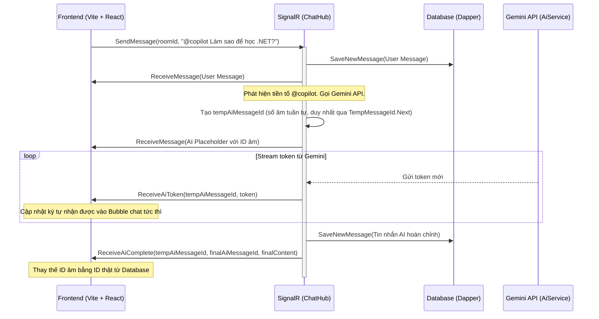

# 🌐 Real-time AI Chat Copilot - Project Context

Tài liệu này cung cấp cái nhìn toàn diện về cấu trúc thư mục, kiến trúc kỹ thuật, luồng dữ liệu và trạng thái hiện tại của dự án **AI Chat Realtime MVP**. Tài liệu giúp các phiên làm việc tiếp theo hiểu ngay hệ thống mà không cần đọc lại toàn bộ mã nguồn.

---

## 🛠️ Công Nghệ Sử Dụng (Tech Stack)

Hệ thống được xây dựng trên mô hình Client-Server tách biệt:

- **Backend**: .NET 8 Web API, SignalR Hub quản lý kết nối thời gian thực.
- **Database**: PostgreSQL kết hợp **Dapper** (truy vấn SQL thuần, tuyệt đối không dùng EF Core).
- **Frontend**: React 19, TypeScript, Ant Design (antd) làm UI system.
  - **Giao diện**: Thiết kế kiểu PipelinePro với nền sáng mặc định + chế độ tối (light/dark), màu chính teal `#0D9488`.
  - **Font chữ**: Inter cho nội dung, Outfit cho tiêu đề (tải từ Google Fonts).
  - **Styling**: Bo góc mềm, CSS variables (token) ở `src/index.css` với `:root[data-theme="light"|"dark"]` cho theme consistency.
  - **Theme Control**: `ThemeContext` + nút `ThemeToggle`, lưu tùy chọn vào `localStorage` (key `nexivra-theme`).
  - **antd Integration**: `ConfigProvider` đồng bộ màu component (colorPrimary teal + light/dark algorithm).
  - **Ghi chú**: Tuân thủ không dùng màu tím (Purple Ban) — màu chính là teal, không phải indigo.
- **AI Integration**: Gemini API (`gemini-2.5-flash`) truyền dữ liệu dạng streaming qua SignalR. `AiService`/`TranslationService` dùng `HttpClient` được quản lý bởi `IHttpClientFactory`.
- **Hiệu năng (Backend)**: Toàn bộ truy cập DB qua Dapper là **async all-the-way** (không block thread pool); có index trên bảng `messages`; HttpClient được pool qua `IHttpClientFactory`. Xem mục "Lịch Sử Tối Ưu Hiệu Năng" bên dưới.

---

## 📁 Cấu Trúc Thư Mục & Các File Quan Trọng

```plaintext
NexivraChat/
├── backend/
│   └── NexivraChatBackend/
│       ├── Controllers/
│       │   ├── AuthController.cs          # Đăng ký & Đăng nhập (async), băm mật khẩu PasswordHasher, cấp JWT.
│       │   ├── RoomsController.cs         # Lấy danh sách phòng, lịch sử tin nhắn của phòng (phân trang) — async.
│       │   ├── UsersController.cs         # Danh sách user, tạo/lấy hội thoại 1-1, lịch sử tin nhắn riêng tư — async.
│       │   ├── ProfileController.cs       # API xem/cập nhật Profile (bio, ngôn ngữ, social links, interests), upload/xoá avatar & phân tích tính cách AI — async. Có ILogger, validate đầu vào, helper BuildResponse (DRY).
│       │   └── TranslationController.cs   # Endpoint POST /api/translation dịch tin nhắn qua TranslationService.
│       ├── Data/
│       │   ├── DapperContext.cs           # Khởi tạo kết nối NpgsqlConnection, cấu hình Map tên thuộc tính dạng snake_case.
│       │   └── DbInitializer.cs           # Tự tạo bảng (users, chat_rooms, private_chats, messages, user_profiles), `ALTER TABLE ... ADD COLUMN IF NOT EXISTS` cho avatar_url/social_links/interests (idempotent), tạo INDEX cho messages, seed phòng mặc định. (Đồng bộ — chạy 1 lần lúc khởi động.)
│       ├── Hubs/
│       │   └── ChatHub.cs                 # Trọng tâm điều phối SignalR: gửi tin nhắn (nhóm & 1-1), điều phối stream AI, presence & typing. Mọi truy cập DB đã async.
│       ├── Models/
│       │   ├── User.cs                    # Bản ghi User (id, username, password_hash, created_at).
│       │   ├── ChatRoom.cs                # Bản ghi ChatRoom (id, name, description).
│       │   ├── Message.cs                 # Bản ghi Message (id, room_id, private_chat_id, sender_name, content, created_at, is_ai).
│       │   ├── PrivateChat.cs             # Bản ghi PrivateChat (id, user1_id, user2_id, created_at).
│       │   └── UserProfile.cs             # Bản ghi UserProfile (user_id, bio, native_language, ai_analysis_json, last_analyzed_at, avatar_url, social_links_json, interests_json). 3 trường mới lưu JSONB-dưới-dạng-string giống pattern ai_analysis_json.
│       ├── Repositories/                  # Tất cả repository dùng Dapper ASYNC (QueryAsync/ExecuteScalarAsync/...), cột tường minh (không SELECT *).
│       │   ├── UserRepository.cs          # Truy vấn dữ liệu User. Có `GetById` (thay cho lối GetAll().FirstOrDefault cũ — hết N+1).
│       │   ├── RoomRepository.cs          # Truy vấn dữ liệu Room.
│       │   ├── MessageRepository.cs       # Lưu tin nhắn mới & lấy lịch sử (theo phòng / chat 1-1 / người gửi).
│       │   ├── PrivateChatRepository.cs   # Lấy hoặc tạo hội thoại 1-1 (đảm bảo u1<u2 cho UNIQUE).
│       │   └── ProfileRepository.cs       # CRUD Profile & dữ liệu AI phân tích (upsert ::jsonb). Đọc/ghi đủ avatar_url, social_links, interests; alias `social_links AS social_links_json` để Dapper map đúng property.
│       ├── Services/
│       │   ├── TokenService.cs            # Tạo mã JWT Token thời hạn 7 ngày.
│       │   ├── AiService.cs               # Gọi Gemini REST (stream IAsyncEnumerable<string>) — HttpClient inject qua IHttpClientFactory.
│       │   ├── TranslationService.cs      # Gọi Gemini dịch thuật — HttpClient inject qua IHttpClientFactory.
│       │   ├── PresenceTracker.cs         # Theo dõi presence in-memory, đếm theo connectionId để xử lý nhiều tab.
│       │   └── TempMessageId.cs           # Sinh temp-ID âm DUY NHẤT cho tin nhắn AI đang stream (Interlocked.Decrement).
│       ├── Properties/
│       │   └── launchSettings.json        # Cấu hình cổng chạy backend (HTTP: 5182, HTTPS: 7103).
│       ├── Program.cs                     # Cấu hình ứng dụng: CORS, JWT Auth, SignalR, DI Container, AddHttpClient<AiService/TranslationService>. Tạo `wwwroot/avatars` lúc startup + `UseStaticFiles()` để phục vụ ảnh avatar.
│       ├── appsettings.json               # Chuỗi kết nối DB PostgreSQL và khóa bí mật JWT.
│       ├── NexivraChatBackend.csproj       # Có thêm `SixLabors.ImageSharp` để decode/resize avatar.
│       └── wwwroot/avatars/                # Nơi lưu avatar đã resize 256×256 webp (tạo tự động lúc startup; phục vụ qua UseStaticFiles).
│   └── NexivraChatBackend.Tests/
│       ├── Fixtures/
│       │   ├── DatabaseFixture.cs         # Quản lý vòng đời Docker container chạy Postgres tự động (Testcontainers) và Respawn dọn dẹp dữ liệu.
│       │   └── DatabaseCollection.cs      # Định nghĩa xUnit Collection để chia sẻ DatabaseFixture.
│       ├── Integration/
│       │   ├── ChatHubTests.cs            # Integration test kiểm thử SignalR ChatHub & phân quyền tham gia DM.
│       │   └── ConversationReadRepositoryTests.cs # Integration test cho repository với logic unread count và UPSERT.
│       ├── PresenceTrackerTests.cs        # Unit test xUnit cho PresenceTracker (6 test cases).
│       └── TempMessageIdTests.cs          # Unit test xUnit cho TempMessageId (2 test: âm & duy nhất khi gọi đồng thời). Tổng cộng 13 test.
│
├── frontend/
│   └── nexivra-chat-frontend/
│       ├── src/
│       │   ├── components/
│       │   │   ├── CopilotPanel.tsx       # Bảng công cụ AI với giao diện PipelinePro (Tóm tắt phòng chat, Gợi ý chủ đề, Giải nghĩa thuật ngữ), nội dung Việt thân thiện.
│       │   │   ├── RoomSidebar.tsx        # Danh sách phòng chat + danh sách user (chat 1-1), tạo phòng mới, thông tin user và nút đăng xuất, hỗ trợ light/dark, nội dung Việt.
│       │   │   ├── MessageBubble.tsx      # Bong bóng 1 tin nhắn, bọc React.memo — khi AI stream chỉ bong bóng đang stream re-render. Gồm tên (mở hồ sơ), nội dung, nút Dịch & bản dịch.
│       │   │   ├── ThemeToggle.tsx        # Nút bóng đèn ở header để chuyển đổi giữa light/dark theme.
│       │   │   └── Logo.tsx               # Logo thương hiệu Nexivra.
│       │   ├── theme/
│       │   │   └── ThemeContext.tsx       # Context provider cho theme management, hook `useTheme`, hàm `getInitialTheme`, lưu preference vào localStorage.
│       │   ├── views/
│       │   │   ├── LoginView.tsx          # Màn hình đăng nhập/đăng ký thiết kế PipelinePro (teal primary, Inter/Outfit font), nội dung Việt.
│       │   │   ├── ChatView.tsx           # Giao diện chính kết nối SignalR Client, hiển thị tin nhắn (nhóm & 1-1), stream AI, dịch tin, online count, typing indicator, hỗ trợ light/dark.
│       │   │   └── ProfileView.tsx        # Modal hồ sơ: avatar (img + upload hover-camera + fallback initials), bio, ngôn ngữ, tag sở thích, social links, và phân tích tính cách AI (radar/thẻ chỉ số). Thứ tự IA: Danh tính → Sở thích → Social → AI. Responsive + a11y (alt/aria, contrast).
│       │   ├── services/
│       │   │   └── api.ts                 # Cấu hình Axios, tự động đính kèm JWT Token vào Header của các yêu cầu API.
│       │   ├── App.tsx                    # Quản lý trạng thái đăng nhập, ThemeProvider + antd ConfigProvider (colorPrimary teal + light/dark algorithm).
│       │   ├── index.css                  # CSS variables (token) cho design system PipelinePro, color, typography, `:root[data-theme="light"|"dark"]`. `--text-muted` đã chỉnh đạt contrast WCAG AA (≥4.5:1) cả 2 theme.
│       │   └── main.tsx                   # Điểm khởi đầu React, set `data-theme` attribute trước render, nạp Google Fonts (Inter/Outfit).
│       ├── index.html                     # Nạp Google Fonts (Inter/Outfit), meta viewport, root div.
│       ├── package.json                   # Các gói phụ thuộc (antd, @microsoft/signalr, axios, vite).
│       └── vite.config.ts                 # Cấu hình Vite.
│
└── docs/
    └── superpowers/
        ├── specs/                         # Thiết kế (spec) các đợt tối ưu hiệu năng theo giai đoạn.
        └── plans/                         # Plan thực thi chi tiết từng giai đoạn (GĐ1, GĐ2, GĐ3).
```

---

## 🗄️ Database Schema (PostgreSQL)

```sql
-- 1. Bảng Users (Lưu thông tin tài khoản)
CREATE TABLE users (
    id SERIAL PRIMARY KEY,
    username VARCHAR(50) UNIQUE NOT NULL,
    password_hash VARCHAR(255) NOT NULL,
    created_at TIMESTAMP DEFAULT CURRENT_TIMESTAMP NOT NULL,
    is_admin BOOLEAN DEFAULT FALSE NOT NULL,
    strike_count INT DEFAULT 0 NOT NULL,
    muted_until TIMESTAMP NULL
);

-- 2. Bảng ChatRooms (Các phòng chat nhóm)
CREATE TABLE chat_rooms (
    id SERIAL PRIMARY KEY,
    name VARCHAR(100) NOT NULL,
    description VARCHAR(255),
    created_at TIMESTAMP DEFAULT CURRENT_TIMESTAMP NOT NULL
);

-- 3. Bảng Messages (Lưu lịch sử tin nhắn bao gồm tin nhắn của AI và tin nhắn 1-1)
CREATE TABLE messages (
    id SERIAL PRIMARY KEY,
    room_id INT REFERENCES chat_rooms(id) ON DELETE CASCADE, -- Nullable đối với chat 1-1
    private_chat_id INT REFERENCES private_chats(id) ON DELETE CASCADE, -- Nullable đối với chat nhóm
    sender_id INT NULL REFERENCES users(id) ON DELETE SET NULL, -- ID người gửi (NULL cho AI)
    sender_name VARCHAR(50) NOT NULL,
    content TEXT NOT NULL,
    created_at TIMESTAMP DEFAULT CURRENT_TIMESTAMP NOT NULL,
    is_ai BOOLEAN DEFAULT FALSE NOT NULL
);

-- 4. Bảng PrivateChats (Hội thoại riêng tư 1-1)
CREATE TABLE private_chats (
    id SERIAL PRIMARY KEY,
    user1_id INT REFERENCES users(id) ON DELETE CASCADE,
    user2_id INT REFERENCES users(id) ON DELETE CASCADE,
    created_at TIMESTAMP DEFAULT CURRENT_TIMESTAMP NOT NULL,
    CONSTRAINT unique_users UNIQUE (user1_id, user2_id)
);

-- 5. Bảng UserProfiles (Hồ sơ người dùng và phân tích AI)
CREATE TABLE user_profiles (
    user_id INT PRIMARY KEY REFERENCES users(id) ON DELETE CASCADE,
    bio VARCHAR(255),
    native_language VARCHAR(50) DEFAULT 'Vietnamese' NOT NULL,
    ai_analysis_json JSONB, -- Lưu kết quả đánh giá tính cách dạng JSON bằng AI
    last_analyzed_at TIMESTAMP,
    avatar_url TEXT,        -- Đường dẫn tương đối tới avatar đã upload, vd /avatars/3_a1b2.webp
    social_links JSONB,     -- Mảng [{ "label": "...", "url": "..." }]
    interests JSONB         -- Mảng ["âm nhạc", "bóng đá", ...]
);
-- 3 cột avatar_url/social_links/interests được DbInitializer thêm idempotent qua
-- ALTER TABLE ... ADD COLUMN IF NOT EXISTS (an toàn cho DB đã tồn tại từ trước).

-- 6. Bảng BannedWords (Lưu từ cấm local)
CREATE TABLE banned_words (
    id SERIAL PRIMARY KEY,
    word VARCHAR(100) UNIQUE NOT NULL,
    tier VARCHAR(20) NOT NULL,
    created_at TIMESTAMP DEFAULT CURRENT_TIMESTAMP NOT NULL
);

-- 7. Bảng ModerationLogs (Lịch sử kiểm duyệt)
CREATE TABLE moderation_logs (
    id SERIAL PRIMARY KEY,
    user_id INT NULL REFERENCES users(id) ON DELETE SET NULL,
    username VARCHAR(50) NOT NULL,
    context_type VARCHAR(20) NOT NULL,
    original_text TEXT NOT NULL,
    tier VARCHAR(20) NOT NULL,
    ai_verdict VARCHAR(20) NULL,
    action VARCHAR(20) NOT NULL,
    created_at TIMESTAMP DEFAULT CURRENT_TIMESTAMP NOT NULL
);

-- 8. Index tối ưu truy vấn lịch sử tin nhắn (DbInitializer tạo, CREATE INDEX IF NOT EXISTS)
CREATE INDEX idx_messages_room_created    ON messages (room_id, created_at);
CREATE INDEX idx_messages_private_created ON messages (private_chat_id, created_at);
CREATE INDEX idx_messages_sender          ON messages (sender_name);
CREATE INDEX idx_messages_sender_id       ON messages (sender_id);
```

---

## 🔄 Quy Trình Xử Lý Real-time & Stream AI (SignalR)



### Sự Kiện SignalR Mới: Presence & Typing (từ phòng ban)

**Hub Methods** (gọi từ Client):

- `JoinRoom(roomId)` — Cập nhật: người dùng tham gia phòng, phát `PresenceUpdate` cho toàn phòng với danh sách online hiện tại.
- `LeaveRoom(roomId)` — Cập nhật: người dùng rời phòng, phát `PresenceUpdate` và reset `TypingUpdate` cho người khác.
- `Typing(roomId, isTyping)` — Client phát: khi bắt đầu hoặc dừng gõ phòng (debounced 2s), phát `TypingUpdate` cho người khác trong phòng.
- `TypingPrivate(receiverId, isTyping)` — Client phát: khi bắt đầu hoặc dừng gõ DM (debounced 2s), phát `PrivateTypingUpdate` tới người nhận.
- `OnDisconnectedAsync()` — Tự động: khi ngắt kết nối, dọn sạch presence khỏi tất cả phòng và phát lại `PresenceUpdate`.

**Client Events** (nhận từ Hub):

- `PresenceUpdate(roomId, usernames[])` — Danh sách tên người dùng online hiện tại, hiển thị online count ở phòng header.
- `TypingUpdate(roomId, username, isTyping)` — Ai đang gõ trong phòng, hiển thị thông báo "username đang gõ..." trên giao diện.
- `PrivateTypingUpdate({fromUserId, isTyping})` — Trạng thái đang gõ DM từ đối phương, hiển thị thông báo "username đang gõ..." khi chat 1-1.

**Tracking**: `PresenceTracker` singleton lưu `(roomId -> (connectionId -> username))`, hỗ trợ một user mở nhiều tab (chỉ offline khi tất cả connection rời).

---

## 🤖 Kiến Trúc Tính Năng AI Mới

### 1. Tính năng Dịch tin nhắn Real-time

Luồng xử lý khi người dùng chọn dịch tin nhắn:

- **Client (Frontend)**: Người dùng nhấn vào nút Dịch trên bong bóng chat của một tin nhắn cụ thể.
- **REST API (Backend)**: Gửi yêu cầu dịch đến `ProfileController` hoặc một endpoint dịch thuật.
- **TranslationService**: Nhận tin nhắn gốc và ngôn ngữ đích (lấy từ tùy chọn của Profile người dùng, mặc định là Vietnamese).
- **Gemini API**: `TranslationService` gọi Gemini API bằng prompt dịch thuật chuyên biệt để dịch nội dung tin nhắn một cách tự nhiên nhất.
- **Phản hồi & Render**: Kết quả dịch được trả về cho Client qua REST API và hiển thị ngay dưới dạng bong bóng chat phụ bên dưới tin nhắn gốc.

### 2. Tính năng Phân tích hồ sơ AI Profile Analyzer

\Luồng xử lý tự động phân tích tính cách và hành vi người dùng qua AI:

- **Thu thập dữ liệu**: Hệ thống lấy lịch sử trò chuyện (tối đa 30 tin nhắn gần nhất) của người dùng từ cơ sở dữ liệu PostgreSQL.
- **Phân tích hành vi**: Gửi prompt được thiết kế sẵn (bao gồm lịch sử chat) đến Gemini API để đánh giá tính cách, sở thích, và xu hướng giao tiếp.
- **Lưu trữ dữ liệu**: Nhận kết quả phân tích dưới dạng cấu trúc JSON từ Gemini và lưu vào trường `ai_analysis_json` (kiểu dữ liệu `JSONB`) trong bảng `user_profiles` cùng với thời gian phân tích `last_analyzed_at`.
- **Hiển thị (Frontend)**: Màn hình `ProfileView.tsx` gọi API lấy thông tin Profile và render giao diện trực quan hóa các chỉ số thông minh, tính cách dưới dạng biểu đồ/thẻ chỉ số thông minh hiện đại (PipelinePro UI).

### 3. Tính năng Quản lý trang cá nhân (Avatar + Social links + Interests)
Mở rộng `user_profiles` với 3 trường mới, để người dùng tự trang trí hồ sơ:
- **Avatar (ảnh thật)**: `POST /api/profile/avatar` nhận `multipart/form-data` (`IFormFile`). Backend validate (file rỗng / >2MB), dùng **SixLabors.ImageSharp** decode → crop vuông → resize **256×256 .webp**, lưu `wwwroot/avatars/{userId}_{guid}.webp`, xoá file cũ. Việc decode cũng chính là cách chống file giả (SVG/.exe đổi đuôi sẽ ném `UnknownImageFormatException` → 400). `userId` lấy từ JWT (chống IDOR). Phục vụ ảnh qua `UseStaticFiles`. `DELETE /api/profile/avatar` để gỡ ảnh về initials.
- **Social links**: mảng `{ label, url }` lưu cột `social_links` (JSONB). Validate scheme chỉ `http/https` (chống XSS khi render `<a href>`), tối đa 8 link.
- **Interests (sở thích)**: mảng string tự do, server trim + lowercase + dedupe + bỏ rỗng, tối đa 15 tag × 30 ký tự. Lưu cột `interests` (JSONB).
- **Đường đi**: `PUT /api/profile` nhận thêm `socialLinks[]` + `interests[]` (avatar đi riêng qua endpoint upload). Mọi GET/PUT trả về mảng đã parse (helper `BuildResponse` — DRY). Frontend `ProfileView.tsx` hiển thị theo thứ tự **Danh tính → Sở thích → Social → AI**; avatar có hover-overlay camera (desktop) + nút Tải/Gỡ trong edit-mode (mobile), `` fallback về initials.
- **Dọn dẹp kỹ thuật kèm theo**: `UserRepository.GetById` (hết N+1 ở `GetUserProfile`), `DateTime.UtcNow` thay `DateTime.Now`, gộp 3 khối JSON mock trùng trong `/analyze` thành 1 hằng (DRY), thêm `ILogger<ProfileController>`.

> **Lưu ý vận hành:** avatar lưu trên filesystem (`wwwroot/avatars`) — local thì ổn, nhưng **không bền qua redeploy container** nếu sau này deploy (cần volume hoặc chuyển object storage/CDN).

---

## 🧪 Hạ Tầng Kiểm Thử Tích Hợp (Integration Test Harness)

Để đảm bảo tính đúng đắn và độc lập của các logic nghiệp vụ phức tạp (như tính toán số tin nhắn chưa đọc unread badges và phân quyền SignalR ChatHub), dự án thiết lập hệ thống kiểm thử tích hợp tự động (Integration Test Suite):

- **Testcontainers.PostgreSql**: Tự động kéo và chạy một Docker container PostgreSQL (`postgres:15-alpine`) khi khởi chạy test suite. Cấu trúc DB được khởi tạo tự động thông qua `DbInitializer`.
- **Respawn**: Reset trạng thái của tất cả các bảng dữ liệu về trạng thái sạch sẽ trước/sau mỗi test case để tránh ảnh hưởng lẫn nhau giữa các test case, giúp tăng tốc độ kiểm thử mà không cần dựng lại database từ đầu.
- **WebApplicationFactory (SignalR Integration)**: Tích hợp SignalR client thực tế kết nối tới server in-memory qua `WebApplicationFactory<Program>`, sử dụng token JWT giả lập để kiểm thử phân quyền truy cập hội thoại riêng tư trong `ChatHub.MarkRead`.

---

## 🚀 Lịch Sử Tối Ưu Hiệu Năng (theo giai đoạn)

Tài liệu thiết kế & plan chi tiết nằm trong `docs/superpowers/`. Thực thi theo quy trình subagent-driven (mỗi task có review spec + chất lượng, cuối mỗi giai đoạn có whole-branch review).

### Giai đoạn 1 — Quick Wins ✅ HOÀN TẤT

- **Index DB**: thêm `idx_messages_room_created`, `idx_messages_private_created`, `idx_messages_sender` trong `DbInitializer` (idempotent).
- **Bỏ `SELECT *`**: mọi repository dùng danh sách cột tường minh.
- **Temp-ID AI**: thay `new Random()` bằng `TempMessageId.Next()` (`Interlocked.Decrement`) — temp-ID âm tuần tự, duy nhất, có unit test.
- **Auto-scroll**: chỉ smooth-scroll khi có tin nhắn mới; dùng `auto` khi AI đang stream token (hết giật).

### Giai đoạn 2 — Async Backend ✅ HOÀN TẤT

- **Async Dapper all-the-way**: tất cả 5 repository (Message/User/Room/PrivateChat/Profile) chuyển sang `QueryAsync`/`ExecuteScalarAsync`/`ExecuteAsync`; mọi caller (ChatHub + Controllers) `await` — không còn block thread pool.
- **IHttpClientFactory**: `AiService` + `TranslationService` nhận `HttpClient` qua DI (`AddHttpClient<T>()`) — hết nguy cơ socket exhaustion.
- Không còn sync-over-async (`.Result`/`.Wait()`) trong codebase.

### Giai đoạn 3 — Frontend Render ✅ HOÀN TẤT

- **Tách `MessageBubble` + `React.memo`**: trích JSX bong bóng khỏi `ChatView`; các handler bọc `useCallback` và dùng `usersRef` để callback ổn định → khi AI stream chỉ bong bóng đang stream re-render thay vì cả danh sách.
- **Lazy-load `ProfileView`** (`React.lazy` + `Suspense`, gate bằng `profileEverOpened`): tách chunk antd nặng (~116 kB) khỏi bundle ban đầu, chỉ tải sau lần đầu mở hồ sơ; giữ animation Modal.
- **Bỏ virtualize** (quyết định YAGNI: chỉ tải 50 tin/phòng nên lợi ích nhỏ, rủi ro với auto-scroll/stream cao).

### Giai đoạn 4 — Keyset Pagination (GĐ4.2), Resync Reconnect (GĐ4.3), Migration sender_id (GĐ4.4) & Trạng thái Đã gửi/Đã xem cho DM (GĐ4.5) ✅ HOÀN TẤT

- **Phân trang Keyset theo ID (GĐ4.2)**: Chuyển đổi từ offset-based sang keyset-based (`beforeId`) tránh lệch tin hoặc trùng lặp khi có tin nhắn mới liên tục. Bỏ qua các ID tin nhắn AI tạm thời (giá trị âm) khi xác định ID tin nhắn cũ nhất.
- **Giữ vị trí cuộn (Scroll Preservation) (GĐ4.2)**: Sử dụng `flushSync` từ `react-dom` để ép React cập nhật DOM đồng bộ trước khi đo và bù trừ `scrollTop` của container, tránh hiện tượng giật màn hình khi tải tin cũ.
- **Tự động tải tin cũ (Intersection Observer) (GĐ4.2)**: Sử dụng API `IntersectionObserver` lắng nghe Sentinel Div ở đầu danh sách tin nhắn để tự động kích hoạt tải thêm lịch sử, đi kèm nút bấm liên kết thủ công làm fallback và hiển thị thông báo "Đầu hội thoại" khi đã tải hết.
- **Tự động Resync tin nhắn sau Reconnect (GĐ4.3 Optimization)**:
  - **Backend**: Nâng cấp `MessageRepository` hỗ trợ tham số `afterId` (WHERE id > @afterId ORDER BY id ASC LIMIT @limit) cho cả Room và Private Chat, và expose qua API Query Param `?afterId=` tại 2 endpoints messages.
  - **Frontend**: Lặp fetch `afterId` liên tục khi reconnect (SignalR `onreconnected`) cho đến khi lô tin nhắn nhận được có số lượng `< 50`, tránh hụt tin khi mất mạng dài; gộp tin nhắn và lọc trùng lặp bằng `Set` ($O(N)$).
- **Migration sender_id (GĐ4.4)**:
  - **Database**: Bổ sung cột `sender_id INT NULL REFERENCES users(id) ON DELETE SET NULL` vào bảng `messages` trong `DbInitializer` (chạy migration idempotent + backfill dữ liệu cũ dựa trên `users.username` cho các tin không phải của AI), đồng thời bổ sung `idx_messages_sender_id`.
  - **Backend & Frontend**: Cập nhật `Message` model (thêm `SenderId`/`senderId`), `MessageRepository` (truy vấn Dapper tường minh có `sender_id`), `ChatHub` (trích xuất user ID từ JWT claim truyền vào `userMessage.SenderId`), và frontend TypeScript interface.
- **Trạng thái Đã gửi/Đã xem cho DM (GĐ4.5)**:
  - **Tái sử dụng hạ tầng**: KHÔNG tạo bảng mới; dựa vào `conversation_reads.last_read_message_id` của đối phương (tin `m` được coi là "Đã xem" nếu `last_read_message_id >= m.id`).
  - **Backend**: Bổ sung `GetPartnerLastReadMessageId` trong `ConversationReadRepository`, trả về header `X-Partner-Last-Read-Id` khi tải lịch sử DM ở `UsersController`, expose header ở CORS `Program.cs`, và phát SignalR event `SeenUpdate` tới người gửi khi đối phương gọi `MarkRead`.
  - **Frontend**: Lắng nghe `SeenUpdate` để cập nhật `partnerLastReadId`, xác định tin nhắn mới nhất do chính mình gửi và hiển thị nhãn "✓ Đã gửi" (màu xám dịu) hoặc "✓✓ Đã xem" (màu Teal `#0D9488`) ngay bên dưới bong bóng chat (`MessageBubble.tsx`). Group/room receipts được hoãn (defer).

### Giai đoạn 5 — Tính năng nâng cao ✅ (GĐ5.1, GĐ5.2 & GĐ5.3 HOÀN TẤT)

- **Reactions (emoji) trên tin nhắn (GĐ5.1)**:
  - **Database**: Tạo bảng `message_reactions (message_id, user_id, emoji)` với Primary Key `(message_id, user_id, emoji)` và index `idx_reactions_message` trong `DbInitializer` (idempotent).
  - **Backend**: Bổ sung `MessageReaction` model, `ReactionSummary` DTO, `ReactionRepository` (với Dapper async `ToggleReaction`, `GetReactionsForMessages`, `LookupConversation`), `ReactionsController` (`GET /api/reactions?messageIds=...`), và SignalR method `ToggleReaction` trong `ChatHub` (validate emoji whitelist `👍❤️😂😮😢🙏` và broadcast event `ReactionUpdate`).
  - **Frontend**: Giải mã JWT token lấy `currentUserId`, quản lý state `reactions`, nạp reaction khi tải lịch sử chat/load tin cũ, lắng nghe SignalR `ReactionUpdate` để cập nhật realtime. Bổ sung hover emoji picker bar và các chip cảm xúc dưới bong bóng chat (`MessageBubble.tsx`) với đường viền Teal `#0D9488` tô điểm cho cảm xúc của chính mình.
- **Reply / Quote (trả lời trích dẫn tin nhắn) (GĐ5.2)**:
  - **Database**: Thêm cột `reply_to_id INT NULL REFERENCES messages(id) ON DELETE SET NULL` và index `idx_messages_reply_to` vào bảng `messages` trong `DbInitializer` (idempotent).
  - **Backend**: Bổ sung `ReplyToId`, `ReplyToSenderName`, `ReplyToContent` vào `Message` model. Cập nhật `MessageRepository` thực hiện `LEFT JOIN messages r ON m.reply_to_id = r.id` chiếu tường minh các thuộc tính snapshot khi nạp lịch sử. Cập nhật `ChatHub.SendMessage` & `SendPrivateMessage` nhận `replyToId`, tự động lookup snapshot tin gốc để gán vào object broadcast thời gian thực.
  - **Frontend**: Thêm nút "Trả lời" trên `MessageBubble.tsx`, quản lý state `replyingTo` trong `ChatView.tsx`, hiển thị thanh preview trích dẫn trên ô nhập liệu (có nút ✕ để hủy), và render khối quote viền Teal `#0D9488` trên bong bóng chat kèm tính năng nhấp cuộn mượt (`scrollIntoView`) tới tin nhắn gốc.
- **Sửa / Xóa tin nhắn (Edit & Soft Delete) (GĐ5.3)**:
  - **Database**: Thêm các cột `edited_at TIMESTAMP NULL` và `deleted_at TIMESTAMP NULL` vào bảng `messages` trong `DbInitializer` (idempotent).
  - **Backend**: Bổ sung `EditedAt` và `DeletedAt` vào `Message` model. Bọc bảo vệ SQL trong toàn bộ các câu truy vấn SELECT của `MessageRepository` (`CASE WHEN m.deleted_at IS NOT NULL THEN '' ELSE m.content END AS Content` và `CASE WHEN r.deleted_at IS NOT NULL THEN NULL ELSE LEFT(r.content, 120) END AS ReplyToContent`) để tuyệt đối không rò rỉ nội dung tin đã thu hồi ra API. Bổ sung hàm `EditMessage` và `SoftDeleteMessage` kiểm tra phân quyền qua `WHERE sender_id=@userId`. Thêm SignalR method `EditMessage` & `DeleteMessage` trong `ChatHub` (kiểm tra `affected == 0` ném `HubException` và broadcast `MessageEdited` / `MessageDeleted`).
  - **Frontend**: Hiển thị nút "Sửa" và "Xóa" trên `MessageBubble.tsx` chỉ cho tin của chính mình (chưa xóa, không AI, id>0). Tích hợp chế độ chỉnh sửa trực tiếp (inline edit), hiển thị nhãn `(đã sửa)` và render tombstone *"Tin đã bị xóa"* mờ nhạt kèm việc tự động ẩn các thao tác tương tác khi tin nhắn bị thu hồi.
- **Checkpoint Test (GĐ4.2 → GĐ5.3 HOÀN TẤT)**:
  - Bổ sung **19 integration tests mới** nâng tổng số test suite từ 13 lên **32 integration tests** chạy tự động qua xUnit và Testcontainers (Passed 100% xanh lá).
  - Khóa an toàn toàn bộ hệ thống phân quyền (Authz DM reaction check, Edit/Delete non-owner check) và bảo mật dữ liệu (SQL CASE WHEN blanking tin nhắn đã thu hồi).
- **GĐ5.4 @mention Nhắc Tên Người Dùng (HOÀN TẤT)**:
  - **DB**: Bảng `message_mentions(message_id, mentioned_user_id)` và index `idx_mentions_user` (idempotent).
  - **Backend**: `MentionRepository` (SaveMentions, GetUnreadMentionRoomIds), `UserRepository.GetByUsernames`. Endpoint `GET /api/users/mentions`. SignalR `ChatHub.SendMessage` parse regex `@([A-Za-z0-9_]+)`, bỏ chính mình và `@copilot`, phát sự kiện `MentionUpdate` realtime.
  - **Frontend**: Autocomplete dropdown gợi ý thành viên khi gõ `@`, highlight token `@username` tô màu Teal `#0D9488`, làm nổi bật khi bản thân được nhắc, chấm nhãn `@` bên cạnh tên phòng ở sidebar và hiển thị toast notification thời gian thực khi phòng nằm ở nền.
- **Hardening #C Kiểm Soát Truy Cập File & Mention Tests (HOÀN TẤT)**:
  - **Bảo mật File DM (#C & #E)**: Chuyển đĩa lưu uploads ra ngoài wwwroot (`ContentRootPath/uploads`), tạo `FilesController.cs` `[Authorize]` truy cập `GET /api/files/{year}/{month}/{filename}` kiểm tra quyền participant DM (trả về 403 Forbidden nếu người ngoài). Map `.webp -> image/webp` để hiển thị inline mượt mà. Mở rộng `JwtBearerEvents.OnMessageReceived` hỗ trợ query `access_token` cho URL đính kèm.
  - **Mention Integration Tests (GĐ5.4-test)**: Tạo `MentionRepositoryTests.cs` bổ sung 2 integration tests nâng tổng bộ test suite lên **34 tests** (Passed 100% xanh lá).
- **GĐ5.7 Typing Indicator Cho DM (HOÀN TẤT)**:
  - **Backend**: Thêm method `TypingPrivate(receiverId, isTyping)` trong `ChatHub.cs` phát sự kiện `PrivateTypingUpdate` thời gian thực tới đúng người nhận (`Clients.User(receiverId.ToString())`).
  - **Frontend**: Quản lý state `privateTypingFrom` và ref timeout 4s tự ngắt, nâng cấp `sendTyping` phân nhánh DM, reset khi đổi hội thoại và hiển thị dòng `"{Username} đang gõ…"` nghiêng mượt mà.
- **GĐ5.6 Tìm Kiếm Tin Nhắn Trong Hội Thoại & Search Tests (HOÀN TẤT)**:
  - **Backend**: Bổ sung `SearchRoomMessages` và `SearchPrivateChatMessages` trong `MessageRepository.cs` với truy vấn ILIKE keyset an toàn (escape `\`, `%`, `_` và truyền qua Dapper parameter `@pattern` kèm `ESCAPE '\'`). Đã thêm các endpoint search `GET /api/rooms/{id}/messages/search` và `GET /api/users/private-chat/{id}/messages/search` (lặp lại bảo mật verify participant DM).
  - **Frontend**: Thêm nút kính lúp tìm kiếm ở header, ô input debounce 350ms, panel kết quả và logic `handleJumpToMessage` nhảy tới đúng tin nhắn + cuộn mượt + bật highlight Teal tự tắt sau 2s (hỗ trợ tự nạp trang tin nhắn cũ nếu tin chưa có trong DOM).
  - **Search Integration Tests (GĐ5.6-test)**: Tạo `MessageSearchTests.cs` bổ sung 3 integration tests nâng tổng bộ test suite lên **37 tests** (Passed 100% xanh lá).
- **Chuẩn Bị Mã Nguồn Deploy Production (Đợt 1 — HOÀN TẤT)**:
  - **Frontend**: Bỏ hardcode API URL (`import.meta.env.VITE_API_BASE_URL`), bổ sung `.env.example` và cấu hình `.gitignore` chặn `.env*`.
  - **Backend CORS & Config**: Đọc `Cors:AllowedOrigins` từ env configuration, giữ `AllowCredentials()` cho SignalR và header `X-Partner-Last-Read-Id`. Secret connection string và JWT key chuyển sang đọc động qua config.
  - **Dockerfile**: Viết `Dockerfile` multi-stage (SDK 8.0 $\rightarrow$ ASP.NET 8.0 runtime) tại `backend/NexivraChatBackend/Dockerfile`.
  - **Health Check & Logging**: Bổ sung endpoint `/health` (dùng NpgSql health check) và cấu hình Serilog log JSON ra stdout cho SignalR & Gemini API errors.
  - **Hardening**: Chuyển `POSTGRES_PASSWORD` trong `docker-compose.yml` và `DatabaseFixture.cs` sang đọc từ biến môi trường `POSTGRES_PASSWORD`.
- **Kiểm duyệt nội dung bằng AI (AI Content Moderation) (HOÀN TẤT)**:
  - **Database**: Thêm bảng `moderation_logs` (lịch sử kiểm duyệt) và `banned_words` (từ cấm local). Thêm các cột `is_admin` (boolean), `strike_count` (int), và `muted_until` (timestamp) vào bảng `users`.
  - **Cơ chế hybrid (Hybrid Moderation Engine)**: Tải và lưu cache danh sách từ cấm local dưới dạng regex pre-compiled lúc startup để đảm bảo tốc độ tối ưu và loại bỏ hoàn toàn các lỗi false-positive do gộp ký tự (collapsing).
    - **Mask-tier (Che ***)**: Từ cấm thuộc `mask-tier` (như `"dm"`, `"vl"`, `"fuck"`) tự động bị thay thế bằng `***` và tin nhắn được gửi đi.
    - **Suspect-tier (Phân loại AI)**: Từ cấm thuộc `suspect-tier` (như `"chem"`, `"giet"`) kích hoạt kiểm duyệt AI bằng Gemini REST API (`AiService.ClassifyAsync`). AI kết luận `TOXIC` sẽ chặn cứng tin nhắn và tính 1 strike cho user. AI kết luận `CLEAN` sẽ cho phép tin nhắn đi tiếp bình thường.
    - **Fail-Closed**: Khi Gemini API lỗi hoặc gặp timeout, hệ thống tự động chặn cứng tin nhắn thuộc `suspect-tier` để đảm bảo an toàn tuyệt đối.
  - **Auto-Mute**: Người dùng vi phạm $\ge$ `StrikeThreshold` (mặc định 3 lần) trong khoảng thời gian `StrikeWindowMinutes` (mặc định 10 phút) sẽ bị tự động khóa chat (mute) trong `MuteDurationMinutes` (mặc định 15 phút).
  - **API & Quản lý Admin**: Cung cấp endpoints quản lý từ cấm (GET/POST/DELETE) và audit logs được phân quyền chỉ Admin (`is_admin = TRUE`) mới có quyền truy cập.
  - **Username validation**: AuthController từ chối đăng ký nếu username chứa từ cấm.
  - **Frontend UI**: Tự động vô hiệu hóa nút gửi tin và upload file khi bị mute, hiển thị thời gian mở khóa trên ô nhập liệu. Hiển thị thông báo toast lỗi chi tiết, giữ lại bản nháp nội dung tin bị chặn để người dùng chỉnh sửa.
  - **Hạ tầng kiểm thử (Tests)**: Bổ sung bộ test unit `ModerationServiceTests.cs` và integration `ModerationIntegrationTests.cs`, nâng tổng số test suite của hệ thống lên **57 tests** (Passed 100% xanh lá).

> **Ghi chú kỹ thuật còn lại (non-blocking):** `TempMessageId` dùng `int`, lý thuyết underflow sau ~2 tỷ lần gọi (không đáng kể).

---

## 🎯 Quyết Định Chiến Lược & Hướng Đi Tiếp Theo

> **Quyết định (qua `/plan-ceo-review`, ngày 2026-06-27): Chọn HƯỚNG 2 — Hoàn thiện các chức năng nền tảng cần thiết nhất, TRƯỚC khi làm tính năng đột phá.**
>
> **Cập nhật (2026-06-28, `/plan-ceo-review`):** Mô hình làm việc = **Claude lập kế hoạch + review, Antigravity 2.0 viết code**. Roadmap thực thi chi tiết (GĐ4.x nền tảng → GĐ5 tính năng giống Zalo/Messenger/Telegram): `docs/superpowers/plans/roadmap-foundation.md`.

**Lý do (CEO review):** Lời hứa cốt lõi của một app chat là "tin nhắn đến nơi và người dùng không bỏ lỡ phản hồi". Phần AI (copilot streaming, dịch, profile analyzer, presence/typing) đã mạnh bất ngờ so với MVP — đó là điểm mạnh. Nhưng nền tảng chat còn vỡ ở những chỗ phá vỡ niềm tin. Làm nền tảng đáng tin trước thì tính năng đột phá (vd: chat đa ngôn ngữ real-time) sau này mới đứng trên nền vững.

**Khoảng trống nền tảng đã xác minh (cần làm — ưu tiên giảm dần):**

1. **Badge "chưa đọc" (unread) theo từng phòng/DM** — ✅ ĐÃ TRIỂN KHAI (branch `feat/unread-badges`). Xem mục "Tính năng Unread Badges" bên dưới.
2. **Tải thêm tin cũ (phân trang lịch sử)** — client luôn gọi `limit=50&offset=0` (`ChatView.tsx:122,132`), không có "tải tin cũ hơn" → lịch sử quá 50 tin không với tới được trong UI.
3. **Resync tin nhắn bị lỡ sau reconnect** — đã có `.withAutomaticReconnect()` (`ChatView.tsx:188`) nhưng khi kết nối lại KHÔNG fetch các tin nhắn phát sinh trong lúc mất mạng → mất tin trên giao diện.
4. **Trạng thái tin nhắn (đã gửi / đã nhận / đã xem)** — chưa có cột/sự kiện delivered/seen; người gửi không biết tin đã tới chưa.

**Cần kiểm tra thêm khi triển khai (nghi ngờ, chưa xác nhận):** phân quyền API lịch sử chat 1-1 (`UsersController` / `private-chat/{id}/messages`) — đảm bảo user A không đọc được hội thoại riêng của người khác qua API.

**Hoãn (để sau khi nền tảng vững):** Tính năng đột phá "Chat đa ngôn ngữ real-time" (tự dịch mọi tin đến sang tiếng mẹ đẻ của từng người đọc, tái dùng `TranslationService` + `native_language`). Đây là điểm khác biệt rẻ vì hạ tầng dịch đã có — ứng viên số 1 cho giai đoạn đột phá kế tiếp.

### Quyết Định Deploy (qua `/plan-ceo-review`, 2026-06-28) — spec: `deploy.md`

> **Mục tiêu:** người ở xa truy cập được, **hoàn toàn free + auto-deploy từ git push**.

**Ràng buộc quyết định:** `.NET 8 + SignalR` giữ WebSocket bền vững → KHÔNG hợp serverless free; bắt buộc host container luôn-chạy cho backend.

**Kiến trúc chốt (mode SELECTIVE EXPANSION):**
- **Backend** (.NET 8 + SignalR, Docker) → **Render** Web Service free (không thẻ, 750h/tháng).
- **Frontend** (React/Vite tĩnh) → **Cloudflare Pages** (không thẻ, load tức thì).
- **Database** → **Neon** Postgres serverless free (`DbInitializer` tự dựng schema, không migration tay).
- **AI** → Gemini free tier (đang dùng).

**Baseline phải sửa trước deploy:** bỏ hardcode `API_BASE_URL` (`api.ts:3`) → `VITE_API_BASE_URL`; CORS đọc từ env giữ `AllowCredentials` (`Program.cs:77`); secrets (DB/JWT/Gemini) → env var; viết Dockerfile .NET 8.

**Add-on đã chốt (cả 4):** cron keep-warm chống cold-start · health check `/health` · secret hardening · Serilog log có cấu trúc.

**Gotcha:** Render free ngủ sau 15' idle → request đầu chờ ~50s (cold start), chỉ chạm lớp realtime; keep-warm xử lý. CORS-credentials sai 1 ký tự là SignalR vỡ.

⚠️ **Cờ bảo mật:** `docker-compose.yml:10` đã commit mật khẩu DB thật vào git — đổi ở mọi nơi còn dùng + chuyển sang env (gói trong add-on secret hardening).

**NOT in scope (TODOS sau):** CI/CD chạy test trước deploy, custom domain, staging, monitoring/alert, Redis backplane scale-out.

#### ✅ ĐÃ LIVE (2026-06-28) — verified end-to-end
- **Frontend:** https://nexivrachat.pages.dev (Cloudflare Pages, auto-deploy từ `main`, root `frontend/nexivra-chat-frontend`, env `VITE_API_BASE_URL`).
- **Backend:** https://nexivrachat.onrender.com (Render Web Service free, Docker, region Oregon, service `srv-d90jp73sq97s739f77c0`, auto-deploy từ `main`). `/health` = 200.
- **DB:** Neon project "NexivraChat" (`royal-waterfall-50039984`), region **AWS us-east-1**, db `neondb`, pooled. `DbInitializer` tự dựng schema.
- **Env vars Render:** `ConnectionStrings__DefaultConnection`, `Jwt__Key`, `Gemini__ApiKey`, `ASPNETCORE_ENVIRONMENT=Production`, `ASPNETCORE_URLS=http://0.0.0.0:8080`, `Cors__AllowedOrigins=https://nexivrachat.pages.dev`.
- **Keep-warm:** `.github/workflows/keepwarm.yml` cron 10' ping `/health`.
- **Verified:** đăng ký user `deploytest1` → chat → gửi tin → SignalR presence "1 người online" chạy thật (WSS). Không lỗi CORS.
- **Lưu ý nợ:** (1) **Đĩa Render free ephemeral** → avatar + file upload mất mỗi lần redeploy (fix sau: R2 object storage). (2) Region lệch (Render Oregon ↔ Neon us-east-1) → query DB qua liên vùng US, chấp nhận cho demo. (3) Gemini key đã bị in 1 lần trong phiên chat — cân nhắc rotate. (4) `deploytest1` là tài khoản test, xoá nếu muốn.

### Tính năng Unread Badges ✅ (branch `feat/unread-badges`, plan: `docs/superpowers/plans/unread-badges-plan.md`)
Server-authoritative: theo dõi "đã đọc đến đâu" cho mỗi user × hội thoại.
- **DB**: bảng `conversation_reads` (user_id, room_id|private_chat_id, last_read_message_id) + CHECK đúng-1-target + 2 partial unique index (`uq_reads_room`, `uq_reads_dm`); thêm index `(room_id, id)` / `(private_chat_id, id)` phục vụ truy vấn `id > last_read`.
- **Backend**: `ConversationReadRepository` (GetUnreadCounts, MarkRoomRead/MarkPrivateChatRead — upsert `ON CONFLICT` + `GREATEST` không lùi mốc); model `UnreadCounts`. Endpoint `GET /api/users/unread-counts`. Hub `MarkRead(roomId?, privateChatId?, lastReadMessageId)` có verify participant cho DM.
- **SignalR mới**: `UnreadUpdate {type, id}` (phòng phát `Clients.All` vì group không tới user ở phòng khác; DM phát tới người nhận, `id` = người gửi); `ReadUpdate {roomId, privateChatUserId}` đồng bộ đa tab.
- **Quy ước key**: phòng key theo `roomId`; DM key theo **id người đối thoại** (để sidebar liệt kê theo user tra cứu badge trực tiếp), trong khi storage/MarkRead vẫn theo `private_chat_id`.
- **Cold-start**: phòng CHƯA mở = 0 unread (INNER JOIN); DM chưa mở vẫn tính đủ (LEFT JOIN + COALESCE) vì DM mới là thứ không được bỏ lỡ.
- **Frontend**: badge ở `RoomSidebar` (DM = số teal `#0F766E`, phòng = dot + chữ đậm), `document.title = "(N) Nexivra Chat"`, mark-read khi mở/nhận tin ở hội thoại active, `onreconnected` refetch counts + tin hội thoại active (fold resync tối thiểu).
- **Còn lại (TODOS.md)**: Hạ tầng test tích hợp (Testcontainers/Respawn kết hợp cơ chế fallback PostgreSQL tự động và kiểm thử SignalR ChatHub) đã được xây dựng hoàn chỉnh và chạy thành công; gating focus/scroll cho mark-read là polish.

---

## ⚠️ Điểm Cần Khắc Phục Hiện Tại (Critical Bugs)

1. **Lỗi import ở `CopilotPanel.tsx`** ✅ ĐÃ SỬA:
   - Dòng 94 đã sử dụng `<BulbOutlined />` (không phải `<LightBulbOutlined />`). Sửa xong, không gây lỗi.
2. **Cài đặt thư viện Frontend** ✅ ĐÃ XONG:
   - Đã chạy `npm install`, thư mục `node_modules` đã có. (Nếu clone mới về thì vẫn cần chạy lại `npm install`.)
3. **Cấu hình Gemini API Key** ✅ ĐÃ SỬA:
   - API key đặt trong `appsettings.Development.json` (gitignored, không commit). `appsettings.json` giữ placeholder trống. `AiService` đã hỗ trợ fallback mock mode khi không có key.
4. **Lỗi PostgresException khi tạo tài khoản (Thiếu cột password_hash và lệch schema cũ)** ✅ ĐÃ SỬA:
   - Phát hiện DB PostgreSQL local tồn tại các bảng `users` và `messages` cũ bị lệch định dạng tên cột và thiếu các cột quan trọng (`password_hash`, `is_ai`).
   - Đã được khắc phục bằng cách DROP các bảng cũ để `DbInitializer` tự động tạo mới hoàn toàn cấu trúc bảng chuẩn khi khởi chạy ứng dụng.
