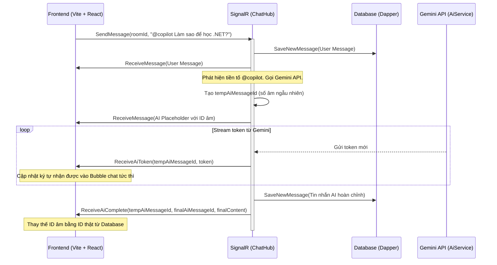

# 🌐 Real-time AI Chat Copilot - Project Context

Tài liệu này cung cấp cái nhìn toàn diện về cấu trúc thư mục, kiến trúc kỹ thuật, luồng dữ liệu và trạng thái hiện tại của dự án **AI Chat Realtime MVP**. Tài liệu giúp các phiên làm việc tiếp theo hiểu ngay hệ thống mà không cần đọc lại toàn bộ mã nguồn.

---

## 🛠️ Công Nghệ Sử Dụng (Tech Stack)

Hệ thống được xây dựng trên mô hình Client-Server tách biệt:
- **Backend**: .NET 8 Web API, SignalR Hub quản lý kết nối thời gian thực.
- **Database**: PostgreSQL kết hợp **Dapper** (truy vấn SQL thuần, tuyệt đối không dùng EF Core).
- **Frontend**: React 19, TypeScript, Ant Design (antd) làm UI system, tuân thủ không dùng màu tím (Purple Ban).
- **AI Integration**: Gemini API (`gemini-2.5-flash`) truyền dữ liệu dạng streaming qua SignalR.

---

## 📁 Cấu Trúc Thư Mục & Các File Quan Trọng

```plaintext
NexivraChat/
├── backend/
│   └── NexivraChatBackend/
│       ├── Controllers/
│       │   ├── AuthController.cs          # Đăng ký & Đăng nhập, băm mật khẩu BCrypt, cấp JWT.
│       │   └── RoomsController.cs         # Lấy danh sách phòng, lịch sử tin nhắn của phòng (phân trang).
│       ├── Data/
│       │   ├── DapperContext.cs           # Khởi tạo kết nối NpgsqlConnection, cấu hình Map tên thuộc tính dạng snake_case.
│       │   └── DbInitializer.cs           # Tự động tạo bảng (users, chat_rooms, messages) và seed dữ liệu phòng mặc định.
│       ├── Hubs/
│       │   └── ChatHub.cs                 # Trọng tâm điều phối SignalR: gửi tin nhắn, tham gia phòng, điều phối stream AI, quản lý presence & typing.
│       ├── Models/
│       │   ├── User.cs                    # Bản ghi User (id, username, password_hash, created_at).
│       │   ├── ChatRoom.cs                # Bản ghi ChatRoom (id, name, description).
│       │   └── Message.cs                 # Bản ghi Message (id, room_id, sender_name, content, created_at, is_ai).
│       ├── Repositories/
│       │   ├── UserRepository.cs          # Truy vấn dữ liệu User bằng Dapper.
│       │   ├── RoomRepository.cs          # Truy vấn dữ liệu Room bằng Dapper.
│       │   └── MessageRepository.cs       # Lưu tin nhắn mới và lấy lịch sử tin nhắn cũ.
│       ├── Services/
│       │   ├── TokenService.cs            # Tạo mã JWT Token thời hạn 7 ngày.
│       │   ├── AiService.cs               # Gọi trực tiếp REST API của Gemini với luồng stream IAsyncEnumerable<string>.
│       │   └── PresenceTracker.cs         # Theo dõi presence in-memory (ai online ở phòng nào), đếm theo connectionId để xử lý nhiều tab.
│       ├── Properties/
│       │   └── launchSettings.json        # Cấu hình cổng chạy backend (HTTP: 5182, HTTPS: 7103).
│       ├── Program.cs                     # Cấu hình ứng dụng: CORS, JWT Auth, SignalR mapping, DI Container.
│       └── appsettings.json               # Chuỗi kết nối DB PostgreSQL và khóa bí mật JWT.
│   └── NexivraChatBackend.Tests/
│       └── PresenceTrackerTests.cs        # Unit test xUnit cho PresenceTracker (6 test cases).
│
├── frontend/
│   └── nexivra-chat-frontend/
│       ├── src/
│       │   ├── components/
│       │   │   ├── CopilotPanel.tsx       # Bảng công cụ AI (Tóm tắt phòng chat, Gợi ý chủ đề, Giải nghĩa thuật ngữ).
│       │   │   └── RoomSidebar.tsx        # Danh sách phòng chat, tạo phòng mới, thông tin user và nút đăng xuất.
│       │   ├── views/
│       │   │   ├── LoginView.tsx          # Màn hình đăng nhập/đăng ký giao diện tối phong cách Terminal.
│       │   │   └── ChatView.tsx           # Giao diện chính kết nối SignalR Client, hiển thị tin nhắn, stream AI, online count, typing indicator và gửi chat.
│       │   ├── services/
│       │   │   └── api.ts                 # Cấu hình Axios, tự động đính kèm JWT Token vào Header của các yêu cầu API.
│       │   ├── App.tsx                    # Quản lý trạng thái đăng nhập toàn cục và điều phối hiển thị LoginView / ChatView.
│       │   ├── index.css                  # Style CSS cơ bản và cấu hình thanh cuộn console.
│       │   └── main.tsx                   # Điểm khởi đầu của ứng dụng React.
│       ├── package.json                   # Các gói phụ thuộc (antd, @microsoft/signalr, axios, vite).
│       └── vite.config.ts                 # Cấu hình Vite.
```

---

## 🗄️ Database Schema (PostgreSQL)

```sql
-- 1. Bảng Users (Lưu thông tin tài khoản)
CREATE TABLE users (
    id SERIAL PRIMARY KEY,
    username VARCHAR(50) UNIQUE NOT NULL,
    password_hash VARCHAR(255) NOT NULL,
    created_at TIMESTAMP DEFAULT CURRENT_TIMESTAMP NOT NULL
);

-- 2. Bảng ChatRooms (Các phòng chat nhóm)
CREATE TABLE chat_rooms (
    id SERIAL PRIMARY KEY,
    name VARCHAR(100) NOT NULL,
    description VARCHAR(255),
    created_at TIMESTAMP DEFAULT CURRENT_TIMESTAMP NOT NULL
);

-- 3. Bảng Messages (Lưu lịch sử tin nhắn bao gồm tin nhắn của AI)
CREATE TABLE messages (
    id SERIAL PRIMARY KEY,
    room_id INT REFERENCES chat_rooms(id) ON DELETE CASCADE,
    sender_name VARCHAR(50) NOT NULL,
    content TEXT NOT NULL,
    created_at TIMESTAMP DEFAULT CURRENT_TIMESTAMP NOT NULL,
    is_ai BOOLEAN DEFAULT FALSE NOT NULL
);
```

---

## 🔄 Quy Trình Xử Lý Real-time & Stream AI (SignalR)



### Sự Kiện SignalR Mới: Presence & Typing (từ phòng ban)

**Hub Methods** (gọi từ Client):
- `JoinRoom(roomId)` — Cập nhật: người dùng tham gia phòng, phát `PresenceUpdate` cho toàn phòng với danh sách online hiện tại.
- `LeaveRoom(roomId)` — Cập nhật: người dùng rời phòng, phát `PresenceUpdate` và reset `TypingUpdate` cho người khác.
- `Typing(roomId, isTyping)` — Client phát: khi bắt đầu hoặc dừng gõ (debounced 2s), phát `TypingUpdate` cho người khác.
- `OnDisconnectedAsync()` — Tự động: khi ngắt kết nối, dọn sạch presence khỏi tất cả phòng và phát lại `PresenceUpdate`.

**Client Events** (nhận từ Hub):
- `PresenceUpdate(roomId, usernames[])` — Danh sách tên người dùng online hiện tại, hiển thị online count ở phòng header.
- `TypingUpdate(roomId, username, isTyping)` — Ai đang gõ, hiển thị thông báo "username đang gõ..." trên giao diện.

**Tracking**: `PresenceTracker` singleton lưu `(roomId -> (connectionId -> username))`, hỗ trợ một user mở nhiều tab (chỉ offline khi tất cả connection rời).

---

## ⚠️ Điểm Cần Khắc Phục Hiện Tại (Critical Bugs)

1. **Lỗi import ở `CopilotPanel.tsx`** ✅ ĐÃ SỬA:
   - Dòng 94 đã sử dụng `<BulbOutlined />` (không phải `<LightBulbOutlined />`). Sửa xong, không gây lỗi.
2. **Cài đặt thư viện Frontend**:
   - Dự án Frontend chưa được cài đặt thư viện (`node_modules`). Cần chạy `npm install` trước khi build hoặc start dev server.
3. **Cấu hình Gemini API Key** ✅ ĐÃ SỬA:
   - API key đặt trong `appsettings.Development.json` (gitignored, không commit). `appsettings.json` giữ placeholder trống. `AiService` đã hỗ trợ fallback mock mode khi không có key.
